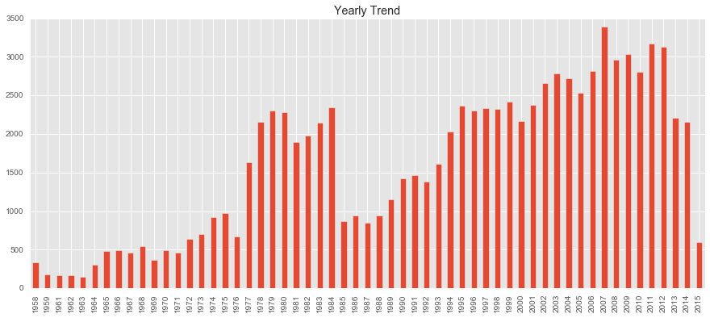
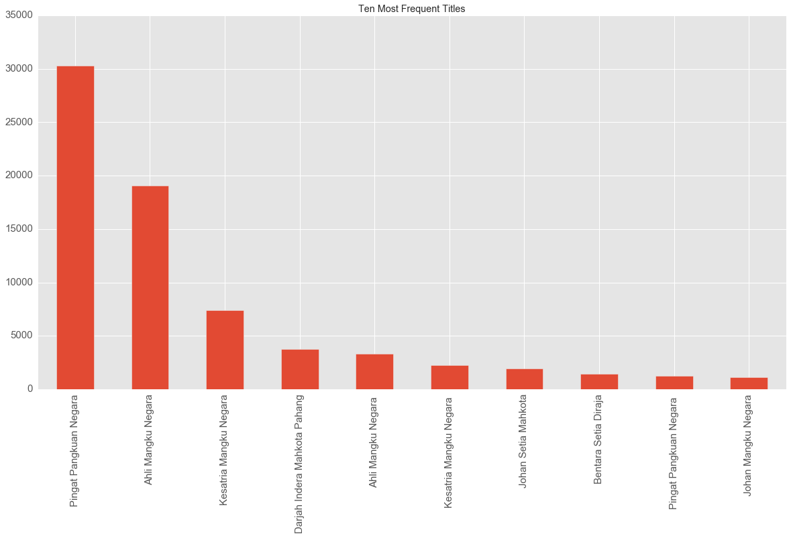

# Malaysian Honorific Title

## Dataset

An interesting [data source](https://www.reddit.com/r/malaysia/comments/4ovwdt/if_you_need_to_check_if_someone_is_a_datuk_or_not/) was pointed out by Reddit user. The site has a complete list of names of people who are awarded with honorific titles in Malaysia from the year 1958 to 2015.

Utilizing a simple Python script, the complete name list is extracted into a CSV file. The columns of the CSV file includes "Anugerah" (name of the title), "Bil" (identification number), "Nama" (recipient of award), "Singkatan" (acronym) and "Tahun Kurniaan" (year of award).

## Background

These honorific titles are awarded to denote appreciation, prestige and other reasons. More information about these different titles can be read in [this Wikipedia article](https://en.wikipedia.org/wiki/Malay_styles_and_titles).

There are two main categories of honorific titles. Firstly, federal titles and secondly, state titles. Federal titles are granted by the Yang di-Pertuan Agong who is the head of state of Malaysia. State titles on the other hand are granted by the Ruler or Governor of the state.

Malaysia has thirteen states. Nine of these states are headed by Malay rulers who come from the respective monarchy of the state. The other four states do not have monarchies but has a ceremonial Governor.

## Obvious Numbers

There are 267 different honorific titles. 91 194 honorific titles are granted to 86 803 different people from the year 1958 to 2015.

From the following graph we can see the yearly trend of the granting of awards.

Intersting notes:
  * A strong drop in year 1985. Then the trend shows an increase beyond year 1988.
  * Another strong drop in year 2013. Then the trend shows a further decrease up to year 2015.

